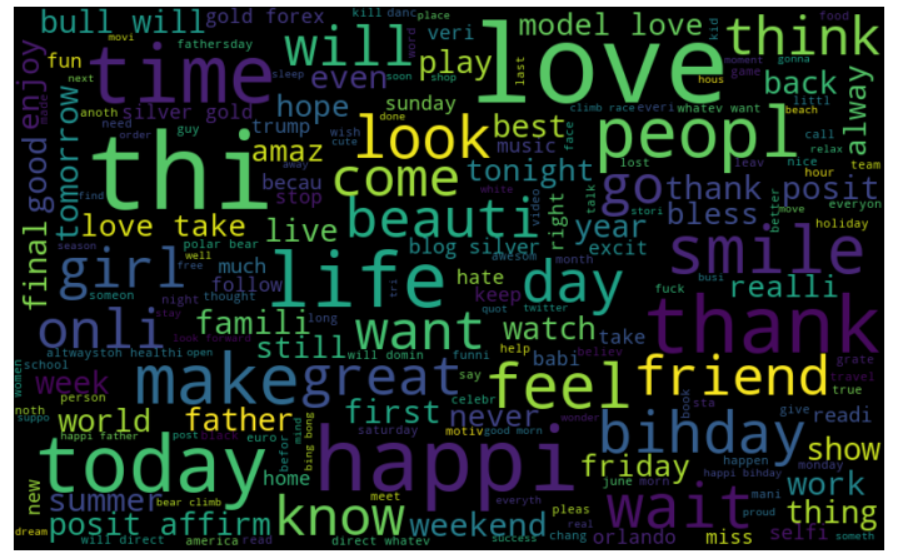

# Automate detection of different sentiments from textual comments and feedback

• The main motive behind this project is to classify whether the 
given feedback or review in textual context is positive or negative. 
Reviews can be given to the model and it classifies the review as a 
negative review or a positive. This shows the emotion of the user.

• Automate detection of different sentiments from textual comments 
and feedback, A machine learning model is created to understand the
sentiments of the twitter tweets. The problem is that the review is
in a textual form and the model should understand the sentiment of 
the tweet and automate a result.

## 🛠Libraries Required

| Library   | Version  |
| :-------- | :------- |
| `NumPy` | `1.21.5+vanilla` |
| `Matplotlib` | `3.5.1` |
| `Seaborn` | `0.11.2` |
| `Plotly` | `5.5.0` | 
| `NLTK` | `3.7` |
| `Scikit-learn` | `1.0.2` |

## Methodology
• The approach was straight forward. I have selected a few 
classifiers algorithms for my project. Firstly, I understood the 
working of the algorithm and read about them.

• After gathering the data set. The first step was to process 
the data. In data processing, I used NLTK (Natural Language 
Toolkit) and cleared the unwanted words in my vector. Using the 
PorterStemmer method stem I shorten the lookup and normalized the 
sentences. Then stored those words which are not a stop word or 
any English punctuation.

• Secondly, I used CountVectorizer  for vectorization as well as 
TfidVectorizer. Also used fit and transform to fit and transform 
the model.

• The next step was Training and Classification. Using 
train_test_split 25% of data was used for testing and remaining 
was used for training. The data were trained on 4 algorithms 
(Naïve Bayes, Random Forest, SGD, Logistic regression).

• Later Confusion matrix metric is used to calculate the 
performance of the model.

• Bar chat is plotted to compare different algorithms accuracy.
## Flow Chart

## 📸Outputs

          wordcloud for all the most used words (both positive as well as negative)

wordcloud only for positive words

wordcloud only for negative words

Bar chart for top 10 positive hashtag

Bar chart for top 10 negative hashtag

Accuracy bar plot of different algorthims trained on tfid feature extraction 

Accuracy bar plot of different algorthims trained on count vectorizer feature extraction

Comparison Accuracy bar plot between tfid and count vectorizer feature extraction

## Enhancement Scope 
There is always a scope of improvement. Here are a few things 
which can be considered to improve.

• Different classifier models can also be tested.  
• Try a different data set. Sometimes a data set plays a crucial 
role too.   
• Some other tuning parameters to improve the accuracy of the model.

## 🔗 Social
You can connect with me here 😀

